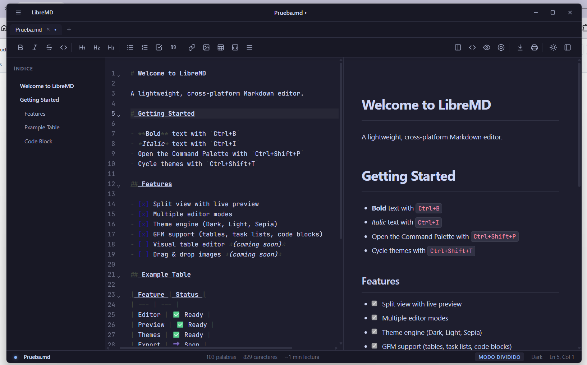
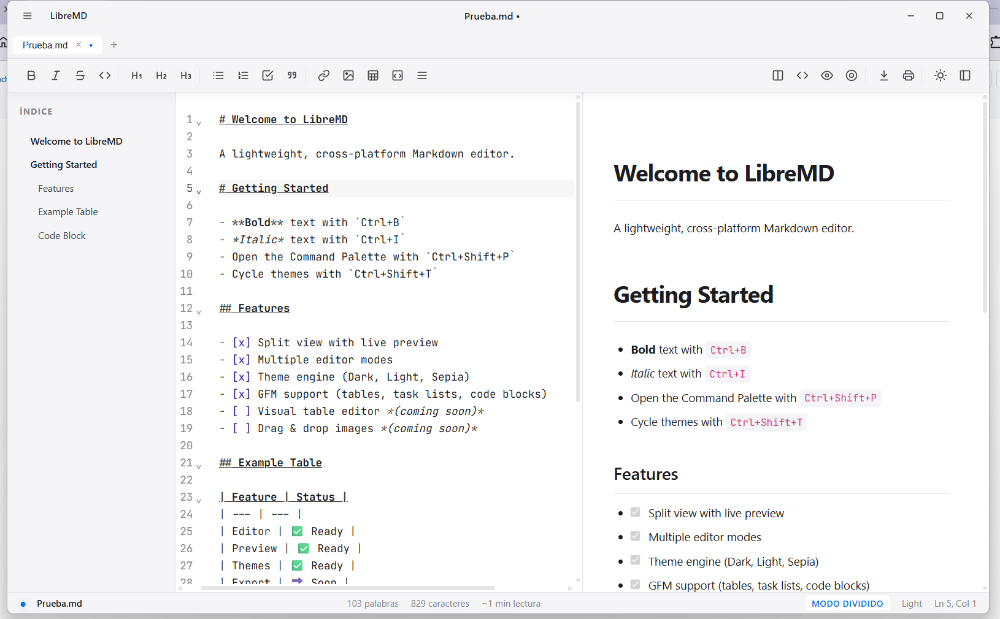
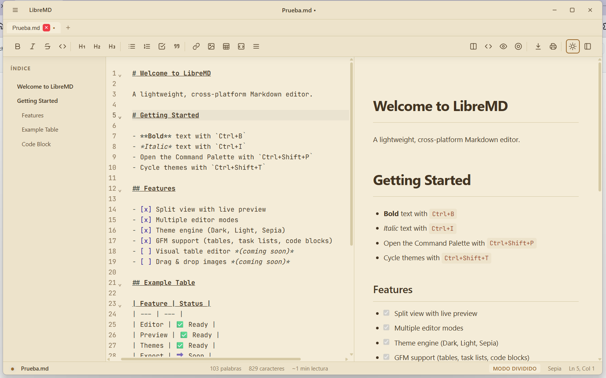
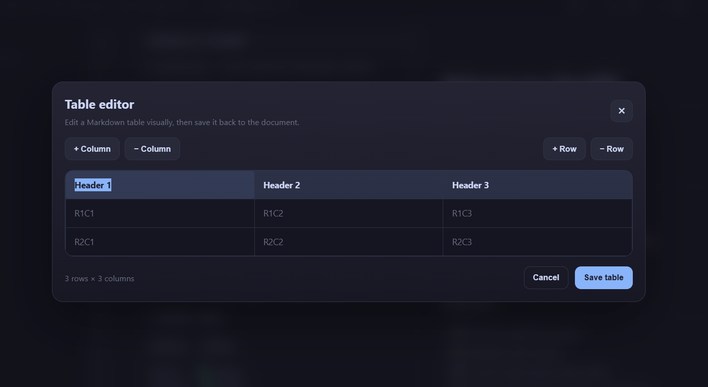

# LibreMD

A lightweight, cross-platform visual Markdown editor — lightweight, powerful, libre.


## Features

- ✨ **Live Preview** — Split view with real-time Markdown rendering
- 🎨 **Multiple Themes** — Dark, Light, and Sepia modes
- 📝 **Editor Modes** — Split, Source-only, Preview-only, and Zen mode
- 🔤 **GFM Support** — Tables, task lists, strikethrough, autolinks, code blocks
- 📊 **Visual Table Editor** — Click the table button to edit tables visually
- 🖼️ **Image Support** — Drag & drop or insert images (saved to `./images/`)
- 💾 **Export** — Export to HTML or PDF
- ⌨️ **Keyboard Shortcuts** — Full shortcut support with Command Palette (Ctrl+Shift+P)

## Screenshots

### Dark Theme — Editor with Live Preview



### Light Theme



### Sepia Theme



### Visual Table Editor



## Download

### Windows

| Format | File | Size |
|--------|------|------|
| NSIS Installer | `LibreMD_0.1.0_x64-setup.exe` | ~3.5 MB |
| MSI Installer | `LibreMD_0.1.0_x64_en-US.msi` | ~3.5 MB |
| Portable EXE | `libremd.exe` | ~3.5 MB |

### Linux & macOS

| Platform | Status |
|----------|--------|
| 🐧 Linux | 🔜 **Próximamente** |
| 🍎 macOS | ✅ **Soporte técnico disponible** |

> **Nota:** El binario para macOS aún no está publicado. Para usarlo, compilá localmente o esperá al próximo release.

### Cómo compilar en macOS

```bash
# Instalar dependencias
npm install

# Compilar para producción
npm run tauri build

# El binario se generará en:
# src-tauri/target/release/bundle/macos/LibreMD.app
```

Para ejecutar la app compilada:
```bash
open src-tauri/target/release/bundle/macos/LibreMD.app
```

O instalar con:
```bash
# Crear DMG
npm run tauri build -- --bundles dmg
```

## Usage

### Keyboard Shortcuts

| Shortcut | Action |
|----------|--------|
| `Ctrl+N` | New document |
| `Ctrl+O` | Open file |
| `Ctrl+S` | Save |
| `Ctrl+Shift+S` | Save As |
| `Ctrl+Shift+E` | Export HTML |
| `Ctrl+P` | Export PDF |
| `Ctrl+Shift+P` | Command Palette |
| `Ctrl+Shift+T` | Cycle theme |
| `Ctrl+B` | Bold |
| `Ctrl+I` | Italic |
| `Ctrl+K` | Insert link |
| `Ctrl+Alt+1` | Split view |
| `Ctrl+Alt+2` | Source only |
| `Ctrl+Alt+3` | Preview only |
| `Ctrl+Alt+4` | Zen mode |

### Image Support

When you insert or drag & drop an image, LibreMD:
1. Saves the image to an `images/` folder next to your `.md` file
2. Inserts a relative Markdown path: ``
3. Shows the image in the live preview

> **Note:** Your document must be saved before inserting images.

### Export Notes

- **HTML Export** — Produces a self-contained HTML file with inline images
- **PDF Export** — Renders text content natively. For documents with images, use **Export as HTML** and print to PDF from your browser for best results.

## Development

### Prerequisites

- [Node.js](https://nodejs.org/) (v18+)
- [Rust](https://rustup.rs/) (latest stable)
- **Windows:** [Visual Studio Build Tools](https://visualstudio.microsoft.com/downloads/) with C++ workload
- **macOS:** Xcode Command Line Tools (`xcode-select --install`)

### Setup

```bash
# Clone the repository
git clone https://github.com/gabogabucho/libreMD.git
cd libreMD

# Install dependencies
npm install

# Run in development mode
npm run tauri dev

# Build for production
npm run tauri build
```

### Project Structure

```
libreMD/
├── src/                    # Frontend source (Vanilla JS)
│   ├── core/              # Core logic (store, editor, renderer, commands)
│   ├── ui/                # UI components (layout, toolbar, preview, etc.)
│   └── main.js            # App entry point
├── src-tauri/             # Tauri backend (Rust)
│   ├── src/lib.rs         # Main Rust code
│   └── Cargo.toml         # Rust dependencies
├── dist/                  # Built frontend assets
└── package.json           # Node dependencies
```

## Tech Stack

- **Frontend:** Vanilla JavaScript, CodeMirror 6
- **Backend:** Rust, Tauri v2
- **Markdown:** unified/remark/rehype (GFM support)
- **PDF:** printpdf (Rust)

## Roadmap

- [x] v0.1.0 — Core editor with live preview
- [x] v0.1.0 — Export HTML/PDF
- [x] v0.1.0 — Table editor
- [x] v0.1.0 — Image insertion
- [x] v0.1.1 — macOS support (configuración técnica)
- [ ] v0.2.0 — Linux builds
- [ ] v0.2.0 — Linux & macOS binaries publicados
- [ ] v0.2.0 — Image support in native PDF export
- [ ] v0.2.0 — Plugin system
- [ ] v0.3.0 — Collaborative editing

## License

MIT © [gabogabucho](https://x.com/gabogabucho)

## Credits

Created by **@gabogabucho**

[github.com/gabogabucho/libreMD](https://github.com/gabogabucho/libreMD)
